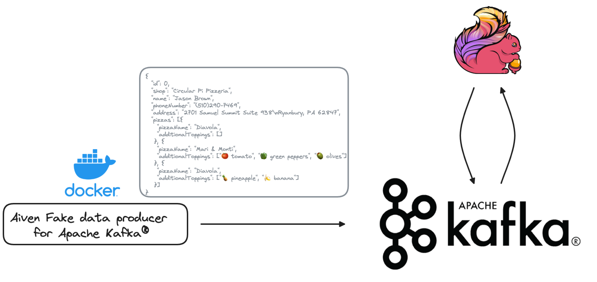
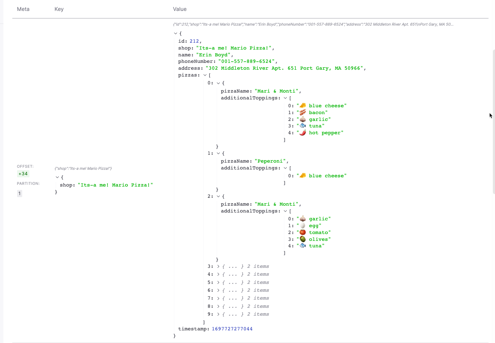
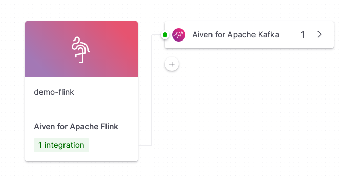

# Anomaly detection with Apache Kafka® and Apache Flink®

This repository contains a series of anomaly detection cases you can discover with Apache Kafka® and Apache Flink®.



The data is generated by a [Docker container](https://github.com/Aiven-Labs/fake-data-producer-for-apache-kafka-docker) running locally and pushing data to an Aiven for Apache Kafka service into a topic called `pizzas`. Moreover 4 different anomaly detection pipelines are defined in Apache Flink to be able to detect increasingly complex anomaly scenarios.

All you need to do is:
* copy the `fakedatagen/params.conf.sample` to `fakedatagen/params.conf` and edit it with
    * your Aiven project name
    * your Aiven account email
    * your Aiven account token

* execute the `./create-workflow.sh` script that will:
    * create the services
    * create the integration
    * start the fake data producer locally on Docker (you'll need docker installed)
    * define the 4 anomaly detection pipelines in Apache Flink

Once the `./create-workflow.sh` script ends:

* Navigate to the Console
    * In Aiven for Apache Kafka service named `demo-kafka` you can show the source of data.
        * Go to **Topics**
        * Select `pizzas`
        * Navigate to **Messages**
        * Click on **Fetch Messages**
        * Toggle the **decode from base64**
        * You should see the orders appearing

        
    
    * Navigate to Aiven for Apache Flink service named `demo-flink`
        * Show the pre-defined integration between `demo-flink` and `demo-kafka`
          
        * Navigate to **Applications**
        * Select `ex-1-BasicFiltering`
            * Click on the **pizza_source** to show the source code definition pointing to the `pizza` topic in Kafka
            
            * Click on the **pizza_filtered** to show the target definition pushing the data to a new topic in Kafka named `pizza_stream_out_filter`
            * Click on **Create new version**
            * The `ex-1-BasicFiltering` app only filters orders with a prohibited ingredient (`where c.topping in ('🍍 pineapple', '🍓 strawberry','🍌 banana')`) in it. In the Screen there's a **Run** button you can use to show the data filtered. 
            
        * Go back to **Applications**
        * Select **ex-2-Aggregating** 
            * This application differs from the previous since it only sends out order with more than 3 prohibited ingredients `having count(*) > 3` show the code and run it
        * Go back to **Applications**
        * Select **ex-3-Windowing** 
            * This application:
                * Creates 5 seconds windows on top of the raw data `TABLE(TUMBLE(TABLE raw_data, DESCRIPTOR(orderTimestamp), interval '5' seconds))`
                * Calculates per topping, how many orders have been recorded with that topping. e.g. `🍍 pineapple` was ordered `500` times within 5 seconds. 
                * It sends out all topping with more than `10` orders within 5 seconds
        * Go back to **Applications**
        * Select **ex-4-Trends**
            * This application
                * Does the windowing similar to the previous one
                * Emits an event only if a topping has the following trend *using `MATCH_RECOGNIZE`:
                    * Initial value for 5 min window -> value Increase -> value decrease for more than 30%
                      ```
                      PATTERN (START_ROW NR_UP NR_DOWN)
                        DEFINE
                            NR_UP AS
                                NR_UP.nr_orders > START_ROW.nr_orders,
                            NR_DOWN AS
                                (NR_UP.nr_orders - NR_DOWN.nr_orders)*100.0/NR_UP.nr_orders > 30
                        )
                       ```

Clicking on **Run** in all the Applications should give you back some data. For the **Trend** one, strong suggestion is to leave the random datagen work for a while.

If you see an error message like the following, go back to Applications and reopen the application again, should be temporary.


To delete/stop everything, run

```
./delete-workflow.sh
```